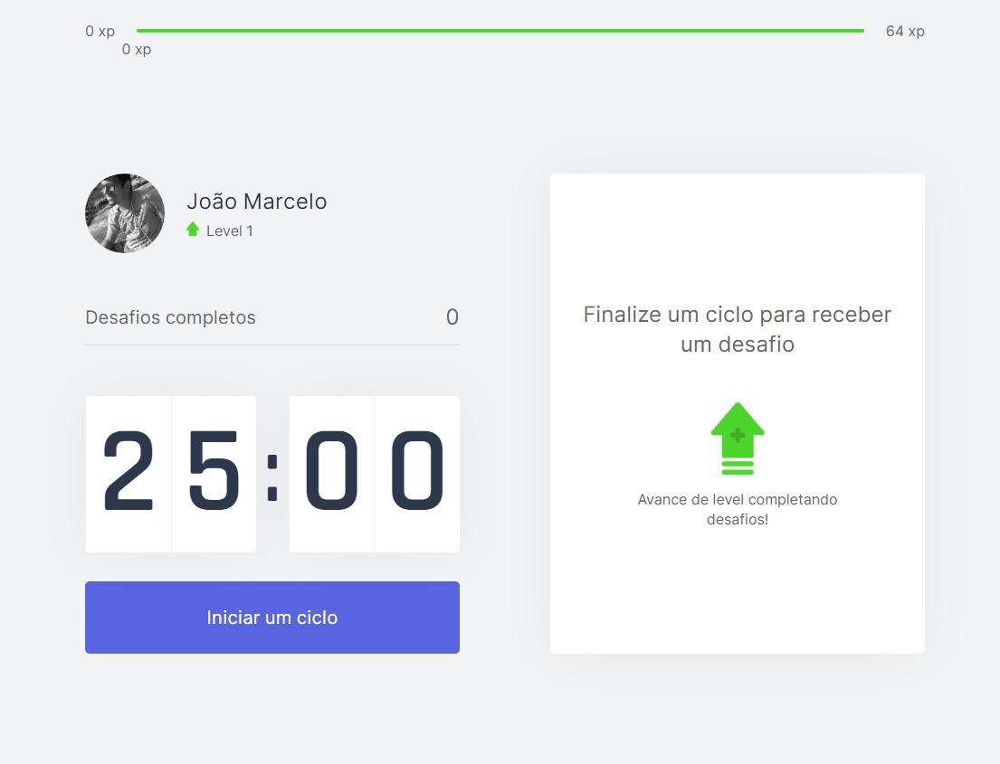
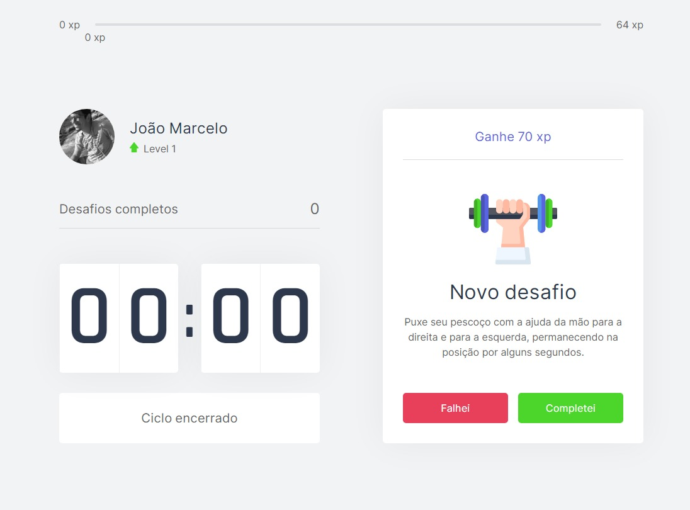

# MoveIt!

Aplicação simples criada com React e Next.js



**Moveit** é uma aplicação web para estimular pessoas que passam muito tempo trabalhando em frente a uma tela a exercitarem o corpo e os olhos. Ao final de cada ciclo, o usuário é lembrando, por meio de uma notificação a fazer alguma atividade fisica rapida, para poder se desprender por alguns minutos da frente do computador.



Cada vez que um desafio é concluido, o usuário ganha uma determinada quantidade xp, e com o tempo sobe de nível.


O **Moveit** foi começou a ser construido durante a NLW4, evento promovido pela [Rocketseat](https://rocketseat.com.br/) com o objetivo de introduzir os participantes às tecnologias mais recentes voltadas para o desenvolvimento Web.

## Tecnologias 

 - React
 - Next.js
 - Node.js
 - Yarn

## Configuração

1. Clonar o repositório:
```
git clone https://github.com/hereisjohnny2/moveit-next.git
```

2. Rodar o yarn no repositório:
```
yarn
```

3. Para rodar o projeto localmente:
```
yarn dev
```
